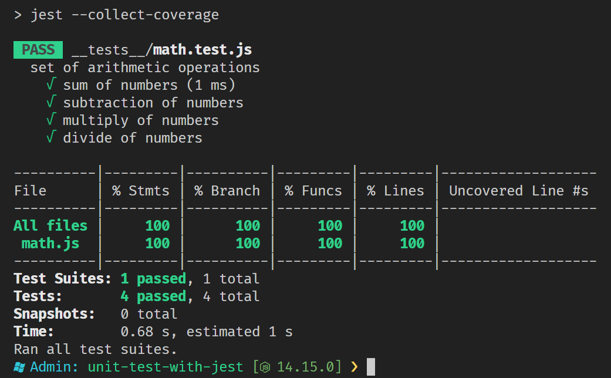

<h1>Hello! I`m Jose Aguilar! 
<h2>QA Enginner || Devops</h2>

Welcome to my GitHub profile!

I'm Jose Aguilar, a passionate QA Engineer with expertise in automation and a software developer. I specialize in software testing and collaborate closely with development teams to ensure high-quality products. My day-to-day work involves crafting test cases, functional testing, regression testing, and automation. I am committed to delivering high-quality software and continuously improving processes.

const jose = {
  pronouns: "he" | "him",
  code: ["Python", "JavaScript", "Ruby", "Java"],
  tools: ["Cypress", "Postman", "Selenium", "JMeter", "TestRail"],
  architecture: ["microservices", "event-driven"],
  techCommunities: {
    coorganizer: null,
    speaker: null,
    mentor: null
  },
  challenge: "I am always learning and exploring new technologies to improve my skills"
}

🛠️ Technologies & Tools
Languages: Python, JavaScript, Ruby, Java
Testing Tools: Cypress, Postman, Selenium, JMeter, TestRail
🌱 Currently
🔭 I'm currently working as a QA Engineer focused on automation.
🤝 I love working collaboratively in a team environment.
📫 Reach out to me
Feel free to connect with me on LinkedIn!

🚀 Goals
I am always eager to learn and explore new technologies to enhance my skills and contribute more effectively to projects.

Thanks for stopping by! 😄
