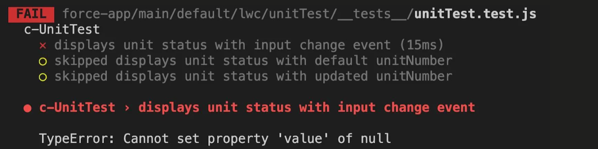

  

<h1 align="start">Ey Testers! Welcome to my Lab 🧪</h1>

<h3 align="start">
Software QA Engineer | SDET-2 | Test Architect | Automation Specialist | API & AI Testing Enthusiast | Performance & Reliability Advocate | Quality Excellence
</h3>

This lab is your go-to space for exploring modern QA strategies and engineering excellence. Dive into:

<ul>
  <li><strong>Test Architectures & Design Patterns:</strong>  scalable test frameworks, modular designs, and maintainable automation strategies.</li>
  <li><strong>AI-driven Testing Approaches:</strong>  leveraging AI/ML for test generation, predictive analytics, and intelligent test optimization.</li>
  <li><strong>Performance & Load Testing Experiments:</strong>  benchmarking, stress testing, and ensuring high availability and reliability.</li>
  <li><strong>Reusable Modules & Scalable Utilities:</strong>  building libraries and helper tools for efficiency and faster test delivery.</li>
  <li><strong>API Testing Strategies & Best Practices:</strong>  contract testing, integration verification, and advanced API automation.</li>
  <li><strong>Modern Automation Frameworks:</strong>  exploring Selenium, Playwright, Cypress, and CI/CD integration for continuous testing.</li>
</ul>

Whether you're a beginner tester or a seasoned SDET, this lab is packed with insights, experiments, and resources to elevate your QA game.

